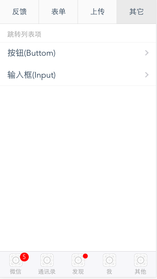

# dingtalkweui

> 钉钉平台、微信平台及普通手机访问平台开发的vue组件库, 能够更快、更方便的调用钉钉sdk、微信sdk及进行普通手机页面开发；

## examples

<table border="0">
    <tr>
        <td>
            
        </td>
        <td>
            
        </td>
        <td>
            
        </td>
    </tr>
</table>


## Docs

- [actionsheet](docs/actionsheet.md)
- [alert](docs/alert.md)
- [Button](docs/button.md)
- [confirm](docs/confirm.md)
- [cascade picker](docs/cascadepicker.md)
- [datepicker](docs/datepicker.md)
- [dropdown](docs/dropdown.md)
- [loading](docs/loading.md)
- [mutipicker](docs/mutipicker.md)
- [Input, Textarea](docs/input.md)
- [preview image](docs/previewImage.md)
- [toast](docs/toast.md)
- [Radio](docs/radio.md)

## Install

install dingtalkweui through npm

```
npm install dingtalkweui --save
```


use in project

```
import Vue from 'vue'
import dingtalkweui from 'dingtalkweui'

Vue.use(dingtalkweui);


// config = { platform: 'dingding' }
// platform can use 'dingding', 'weixin', 'normal' 

或者 Vue.use(dingtalkweui, config); 

```

## 开发

安装

```
git clone https://github.com/pf12345/dingtalkweui.git
cd dingtalkweui
npm install
```

运行

```
npm run dev

浏览器访问：localhost:8080
```

编译

```
npm run dist
```

<!-- ### 文档

<a href="https://pf12345.gitbooks.io/dingtalkweui-api/content/" target="_blank">Documents</a> -->


### 贡献

如果你有好的意见或建议，欢迎给我们提issue或pull request。


### License

The MIT License(http://opensource.org/licenses/MIT)

请自由地享受和参与开源

