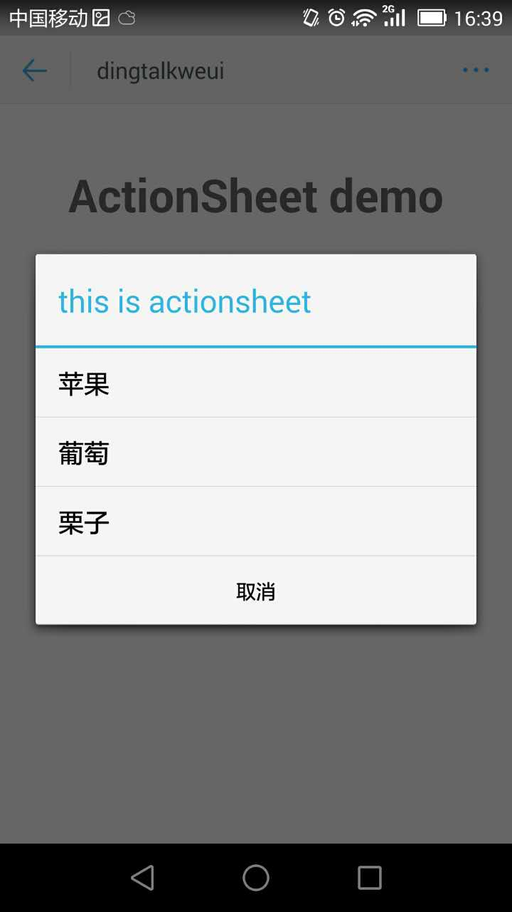
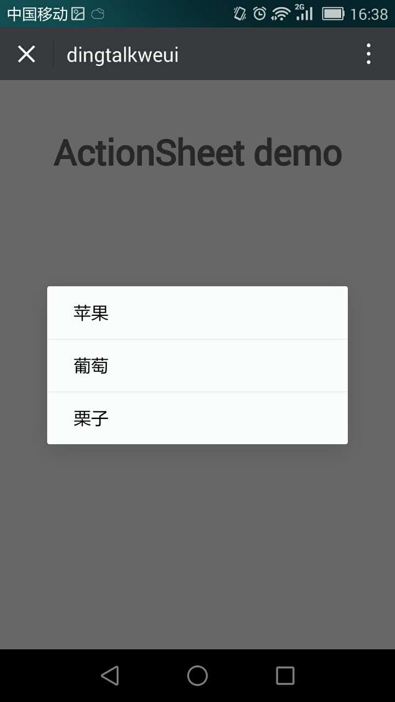

<a name="actionSheet"></a>

## actionSheet([options])
actionsheet 弹出式菜单

**Example Image** 
<table border="0">
    <tr>
        <td>
            
            <p>Dingtalk ActionSheet</p>
        </td>
        <td>
            
            <p>Weui ActionSheet</p>
        </td>
    </tr>
</table>


**Kind**: global function  

| Param | Type | Description |
| --- | --- | --- |
| [options] | <code>object</code> | 配置项 |
| [options.title] | <code>string</code> | 弹窗的标题 |
| [options.cancelButton] | <code>string</code> | 自定义取消按钮名称 |
| [options.options] | <code>array</code> | 下层的选项 |
| [options.cancelClick] | <code>function</code> | 选项点击时的回调 |

**Example**  

```
<template>
  <div class="hello">
    <h1>ActionSheet demo</h1>
  </div>
</template>

<script>
export default {
  name: 'ActionSheet',
  data () {
    return {
      
    }
  },
  mounted() {
    this.$actionsheet.show({
      title: 'this is actionsheet',
      options: [
        {
          label: '苹果',
          onClick() {
            alert('click 苹果')
          }
        },
        {
          label: '葡萄',
          onClick() {
            alert('click 葡萄')
          }
        },
        {
          label: '栗子',
          onClick() {
            alert('click 栗子')
          }
        }
      ],
      cancelClick: function() {
        alert('click cancel');
      }
    });
  }
}
</script>

<style scoped>

</style>

```
