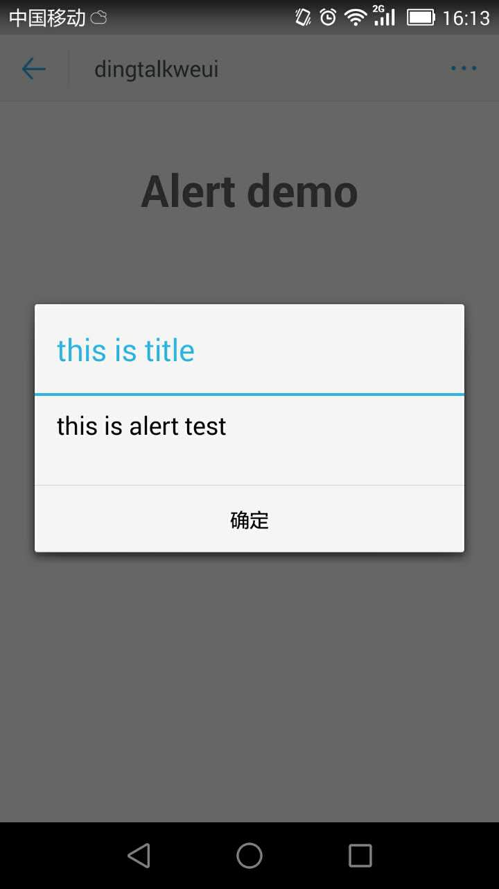
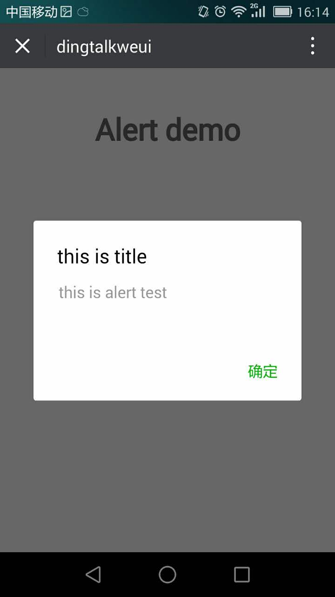

<a name="alert"></a>

## alert([options])
alert 警告弹框，功能类似于浏览器自带的 alert 弹框，用于提醒、警告用户简单扼要的信息，只有一个“确认”按钮，点击“确认”按钮后关闭弹框。

**Example Image** 
<div style="text-align: center;">
	<div style="display: inline-block;width: 200px;">
	
<p style="text-align: center;">Dingtalk Alert</p>
	</div>
	<div style="display: inline-block;width: 200px;margin-left: 20px;">
	
<p style="text-align: center;">Weui Alert</p>
	</div>
</div>


**Kind**: global function  

| Param | Type | Description |
| --- | --- | --- |
| [options] | <code>object</code> | 配置项 |
| [options.content] | <code>string</code> | 弹窗的内容 |
| [options.title] | <code>string</code> | 弹窗的标题 |
| [options.button] | <code>string</code> | 自定义按钮名称 |
| [options.success] | <code>function</code> | 点击确定回调 |

**Example**  

```
<template>
  <div class="hello">
    <h1>Alert demo</h1>
  </div>
</template>

<script>
export default {
  name: 'Alert',
  data () {
    return {
      
    }
  },
  mounted() {
    this.$alert.show({
      content: 'this is alert test',
      title: 'this is title',
      success: function() {
        alert('click button');
      }
    });
  }
}
</script>

<style scoped>

</style>

```
