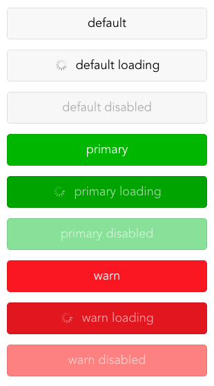
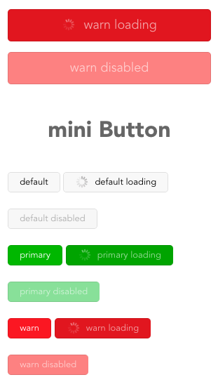

<a name="button"></a>

## Button([options])
Button 按钮

**Example Image** 

<table border="0">
    <tr>
        <td>
            
            <p>Long button</p>
        </td>
        <td>
            
            <p>Mini button</p>
        </td>
    </tr>
</table>


**Button props**

<table border="0" style="font-size: 14px;">
    <tr>
      <th>属性</th>
      <th>说明</th>
      <th>类型</th>
      <th>默认值</th>
    </tr>
    <tr>
        <td>type</td>
        <td>按钮类型，可选值为primary、default、warn或者不设置</td>
        <td>String</td>
        <td>-</td>
    </tr>
    <tr>
        <td>size</td>
        <td>按钮大小，可选值为mini、default或者不设置</td>
        <td>String</td>
        <td>-</td>
    </tr>
    <tr>
        <td>disabled</td>
        <td>设置按钮为禁用状态</td>
        <td>Boolean</td>
        <td>false</td>
    </tr>
    <tr>
        <td>loading</td>
        <td>设置按钮为加载中状态</td>
        <td>Boolean</td>
        <td>false</td>
    </tr>
</table>

**Example**  

```
<template>
  <div>
    <!--- default button --->
    <dw-button type="default">default</dw-button>
    <dw-button type="default" :loading="true">default loading</dw-button>
    <dw-button type="default" :disabled="true">default disabled</dw-button>
    
    <!--- primary button --->
    <dw-button type="primary">primary</dw-button>
    <dw-button type="primary" :loading="true">primary loading</dw-button>
    <dw-button type="primary" :disabled="true">primary disabled</dw-button>
    
    <!--- mini warn button --->
    <dw-button type="warn" size="mini">warn</dw-button>
    <dw-button type="warn" :loading="true" size="mini">warn loading</dw-button>
    <dw-button type="warn" :disabled="true" size="mini">warn disabled</dw-button>
  </div>
</template>

<script>
export default {

}
</script>

<style scoped>

</style>

```


