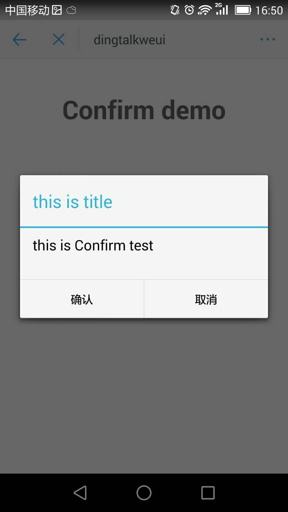
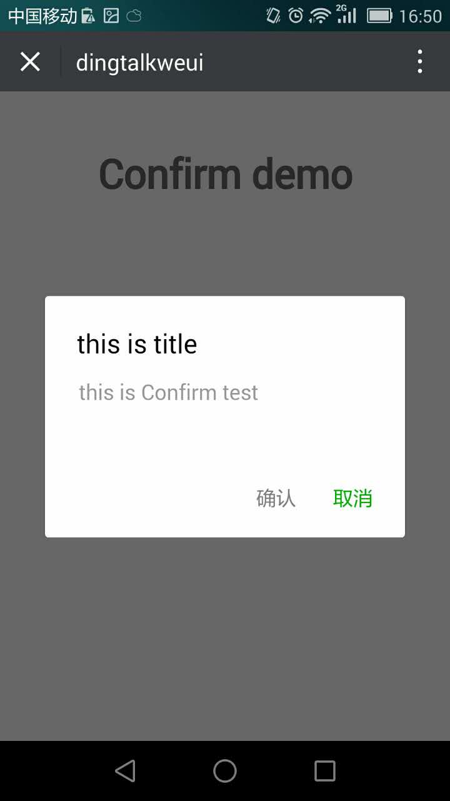

<a name="actionSheet"></a>

## confirm([options])
confirm 确认弹窗

**Example Image** 
<table border="0">
    <tr>
        <td>
            
            <p>Dingtalk Confirm</p>
        </td>
        <td>
            
            <p>Weui Confirm</p>
        </td>
    </tr>
</table>


**Kind**: global function  

| Param | Type | Description |
| --- | --- | --- |
| [options] | <code>object</code> | 配置项 |
| [options.title] | <code>string</code> | 确认弹窗的标题 |
| [options.content] | <code>string</code> | 确认弹窗的内容 |
| [options.buttons] | <code>array</code> | 按钮配置项 |

**Example**  

```
<template>
  <div class="hello">
    <h1>Confirm demo</h1>
  </div>
</template>

<script>
export default {
  name: 'Confirm',
  data () {
    return {
      
    }
  },
  mounted() {
    this.$confirm.show({
      content: 'this is Confirm test',
      title: 'this is title',
      buttons: [{
        label: '确认',
        type: 'default',
        onClick: function(){
          alert('ok')
        }
      }, {
        label: '取消',
        type: 'primary',
        onClick: function(){
          alert('cancel')
        }
      }]
    });
  }
}
</script>

<style scoped>

</style>


```
