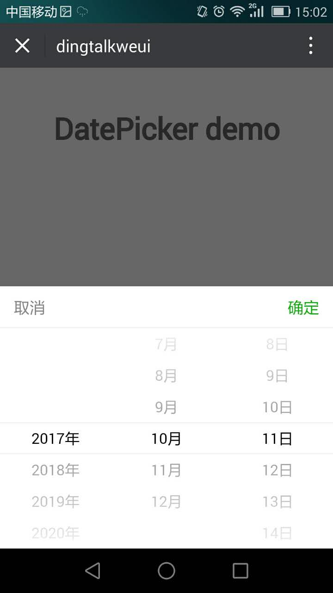

<a name="actionSheet"></a>

## datepicker([options])
datepicker

**Example Image** 
<table border="0">
    <tr>
        <td>
            
            <p>Dingtalk datepicker</p>
        </td>
        <td>
            
            <p>Weui datepicker</p>
        </td>
    </tr>
</table>


**Kind**: global function  

| Param | Type | Description |
| --- | --- | --- |
| [options] | <code>object</code> | 配置项 |
| [options.defaultValue] | <code>string</code> | 默认显示日期 |
| [options.success] | <code>function</code> | 点击确定回调 |

**Example**  

```
<template>
  <div class="hello">
    <h1>DatePicker demo</h1>
  </div>
</template>

<script>
export default {
  name: 'DatePicker',
  data () {
    return {
      
    }
  },
  mounted() {
    this.$datepicker.show({
      success(result) {
        try {
          alert(JSON.stringify(result))
        }catch(e) {
          alert(result)
        }
      }
    });
  }
}
</script>

<style scoped>

</style>


```
