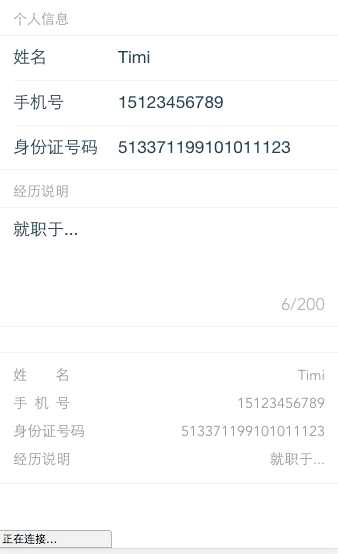

<a name="Input"></a>

## Input
Input 输入框

**Example Image** 

<table border="0">
    <tr>
        <td>
            
        </td>
    </tr>
</table>


**Input props**

<table border="0" style="font-size: 14px;">
    <tr>
      <th>属性</th>
      <th>说明</th>
      <th>类型</th>
      <th>默认值</th>
    </tr>
    <tr>
        <td>title</td>
        <td>标题</td>
        <td>String</td>
        <td>-</td>
    </tr>
    <tr>
        <td>value</td>
        <td>绑定的值，可使用 v-model 双向绑定</td>
        <td>String | Number</td>
        <td>空</td>
    </tr>
    <tr>
        <td>type</td>
        <td>输入框类型，可选值为 text、password、number</td>
        <td>String</td>
        <td>text</td>
    </tr>
    <tr>
        <td>placeholder</td>
        <td>占位文本</td>
        <td>String</td>
        <td>－</td>
    </tr>
    <tr>
        <td>readonly</td>
        <td>设置输入框为只读</td>
        <td>Boolean</td>
        <td>false</td>
    </tr>
    <tr>
        <td>maxlength</td>
        <td>最大输入长度</td>
        <td>Number</td>
        <td>50</td>
    </tr>
</table>

**Input Events**

<table border="0" style="font-size: 14px;">
    <tr>
      <th>事件名</th>
      <th>说明</th>
      <th>返回值</th>
    </tr>
    <tr>
        <td>on-enter</td>
        <td>按下回车键时触发</td>
        <td>无</td>
    </tr>
    <tr>
        <td>on-click</td>
        <td>点击触发</td>
        <td>无</td>
    </tr>
    <tr>
        <td>on-change</td>
        <td>数据改变时触发</td>
        <td>无</td>
    </tr>
    <tr>
        <td>on-focus</td>
        <td>输入框聚焦时触发</td>
        <td>无</td>
    </tr>
    <tr>
        <td>on-blur</td>
        <td>输入框失去焦点时触发</td>
        <td>无</td>
    </tr>
    <tr>
        <td>on-keyup</td>
        <td>原生的 keyup 事件</td>
        <td>无</td>
    </tr>
    <tr>
        <td>on-keydown</td>
        <td>原生的 keydown 事件</td>
        <td>无</td>
    </tr>
    <tr>
        <td>on-keypress</td>
        <td>原生的 keypress 事件</td>
        <td>无</td>
    </tr>
</table>

**Example**  

```
<template>
  <div>
      <dw-form title="表单">
          <dw-input title="手机号" v-model="phone" placeholder="输入你的手机号码"></dw-input>

          <dw-input title="身份证号码" placeholder="输入你的身份证号码"></dw-input>

          <dw-input title="验证码" placeholder="请输入验证码"></dw-input>

          <dw-textarea title="文本域" placeholder="说明"></dw-textarea>
      </dw-form>
  </div>
</template>

<script>
export default {
    phone: ''
}
</script>

<style scoped>

</style>

```


