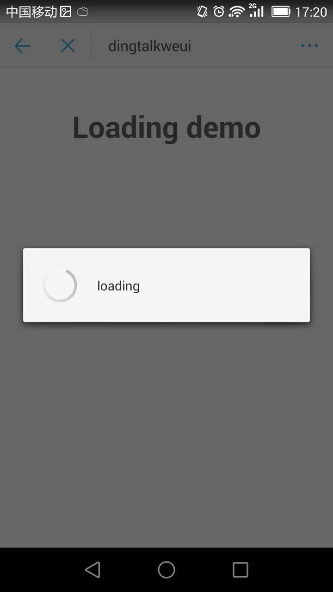
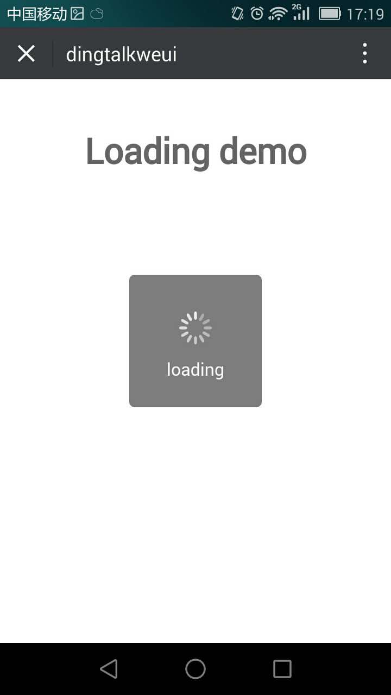

<a name="actionSheet"></a>

## loading(content, function)
loading

**Example Image** 
<table border="0">
    <tr>
        <td>
            
            <p>Dingtalk Loaing</p>
        </td>
        <td>
            
            <p>Weui Loaing</p>
        </td>
    </tr>
</table>


**Kind**: global function  

| Param | Type | Description |
| --- | --- | --- |
| [content] | <code>string</code> | loading内容 |
| [function] | <code>function</code> | 成功回调 |

**Example**  

```
<template>
  <div class="hello">
    <h1>Loading demo</h1>
  </div>
</template>

<script>
export default {
  name: 'Loading',
  data () {
    return {
      
    }
  },
  mounted() {
    this.$loading.show('loading', function() {
      alert('start loading');
    });
    setTimeout(() => {
      this.$loading.hide(function() {
      alert('end loading');
    });
    }, 3000)
  }
}
</script>

<style scoped>

</style>

```
