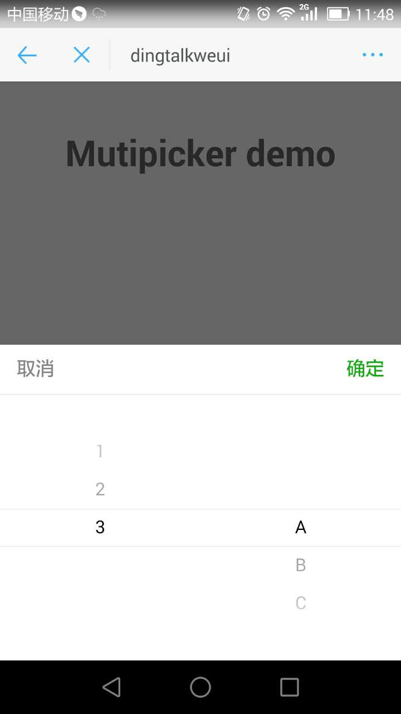
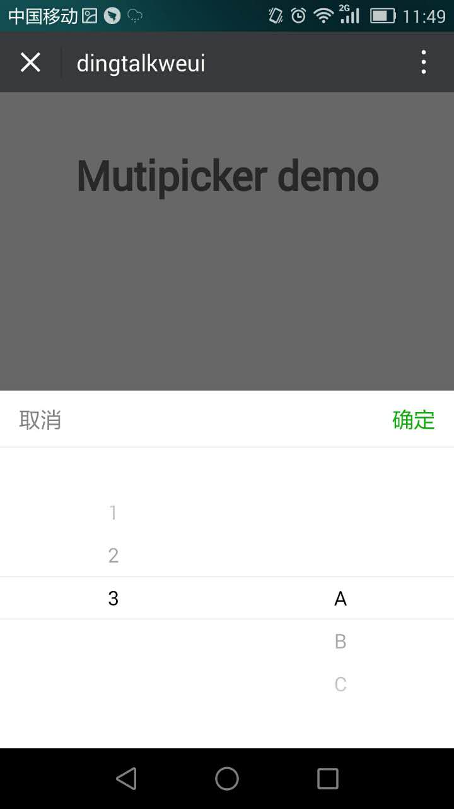

<a name="mutipicker"></a>

## mutipicker([options])
mutipicker 两列下拉

**Example Image** 
<table border="0">
    <tr>
        <td>
            
            <p>Dingtalk mutipicker</p>
        </td>
        <td>
            
            <p>Weui mutipicker</p>
        </td>
    </tr>
</table>


**Kind**: global function  

| Param | Type | Description |
| --- | --- | --- |
| [options] | <code>object</code> | 配置项 |
| [options.defaultItems1] | <code>array</code> | 第一列选项列表 |
| [options.defaultItems2] | <code>array</code> | 第二列选项列表 |
| [options.defaultValue] | <code>array</code> | 默认展示列表value选项值数组 |
| [options.success] | <code>function</code> | 点击确定回调 |

**Example**  

```
<template>
  <div class="hello">
    <h1>Mutipicker demo</h1>
  </div>
</template>

<script>
export default {
  name: 'Mutipicker',
  data () {
    return {
      
    }
  },
  mounted() {
    this.$mutipicker.show({
      defaultItems1: [{
          label: '1',
          value: '1'
      }, {
          label: '2',
          value: '2'
      }, {
          label: '3',
          value: '3'
      }],
      defaultItems2: [{
          label: 'A',
          value: 'A'
      }, {
          label: 'B',
          value: 'B'
      }, {
          label: 'C',
          value: 'C'
      }],
      defaultValue: ['3', 'A'],
      success: function(result) {
        try {
          alert(JSON.stringify(result))
        }catch(e) {
          alert(result);
        } 
      }
    });
  }
}
</script>

<style scoped>

</style>


```
