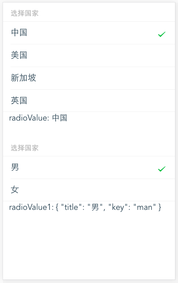

<a name="Radio"></a>

## Radio
Radio 单选

**Example Image** 

<table border="0">
    <tr>
        <td>
            
        </td>
    </tr>
</table>


**Radio props**

<table border="0" style="font-size: 14px;">
    <tr>
      <th>属性</th>
      <th>说明</th>
      <th>类型</th>
      <th>默认值</th>
    </tr>
    <tr>
        <td>title</td>
        <td>标题</td>
        <td>String</td>
        <td>-</td>
    </tr>
    <tr>
        <td>value</td>
        <td>绑定的默认值，可使用 v-model 双向绑定</td>
        <td>String | Number</td>
        <td>空</td>
    </tr>
    <tr>
        <td>datas</td>
        <td>单选选项列表，可字符串数组如：['男', '女']; 可对象数组如：[{title: '男', key: 'man'}, {title: '女', 'key': 'woman'}]</td>
        <td>Array</td>
        <td>-</td>
    </tr>
    <tr>
        <td>placeholder</td>
        <td>占位文本</td>
        <td>String</td>
        <td>－</td>
    </tr>
    
</table>

**Radio Events**

<table border="0" style="font-size: 14px;">
    <tr>
      <th>事件名</th>
      <th>说明</th>
      <th>返回值</th>
    </tr>
    <tr>
        <td>on-ok</td>
        <td>选中某个选项时触发</td>
        <td>选中后传入的datas的选中项数据</td>
    </tr>
</table>

**Example**  

```
<template>
    <div>
        <dw-radio :datas="radioOptions" v-model="radioValue" title="选择国家"></dw-radio>
        <p>radioValue: {{radioValue}}</p>
        <br>
        <dw-radio :on-ok="selected" :datas="radioOptions1" v-model="radioValue1" title="选择国家"></dw-radio>
        <p>radioValue1: {{radioValue1}}</p>
    </div>
</template>
<style scoped>
    p{
        margin: 0 12px;
    }
</style>
<script>
    export default {
        data() {
            return {
                radioOptions: ['中国', '美国', '新加坡', '英国'],
                radioOptions1: [{title: '男', key: 'man'}, {title: '女', 'key': 'woman'}],
                radioValue: '中国',
                radioValue1: ''
            }
        },
        methods: {
            selected(res) {
                alert(JSON.stringify(res))
            }
        }
    }
</script>

```


