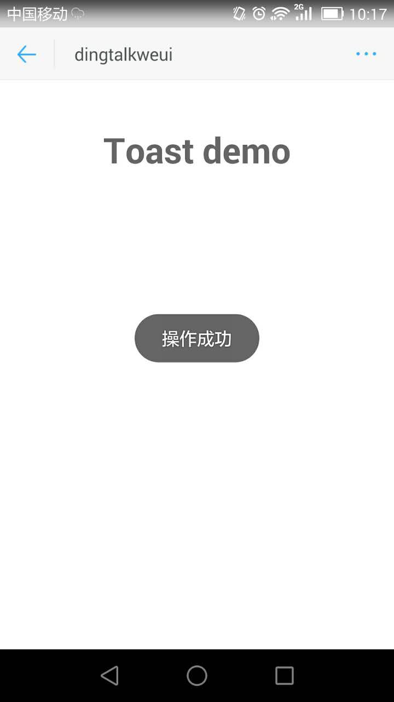

<a name="toast"></a>

## toast([options])
toast 一般用于操作成功时的提示

**Example Image** 
<table border="0">
    <tr>
        <td>
            
            <p>Dingtalk toast</p>
        </td>
        <td>
            
            <p>Weui toast</p>
        </td>
    </tr>
</table>


**Kind**: global function  

| Param | Type | Description |
| --- | --- | --- |
| [options] | <code>object</code> | 配置项 |
| [options.content] | <code>string</code> | 弹窗的内容 |
| [options.isError] | <code>boolean</code> | 非钉钉情况下，错误提示时，使用设为true |
| [options.duration] | <code>number</code> | 多少毫秒后关闭toast |

**Example**  

```
<template>
  <div class="hello">
    <h1>Toast demo</h1>
  </div>
</template>

<script>
export default {
  name: 'Toast',
  data () {
    return {
      
    }
  },
  mounted() {
    this.$toast.show({
      content: '操作成功',
      duration: 3000
    });
  }
}
</script>

<style scoped>

</style>


```
